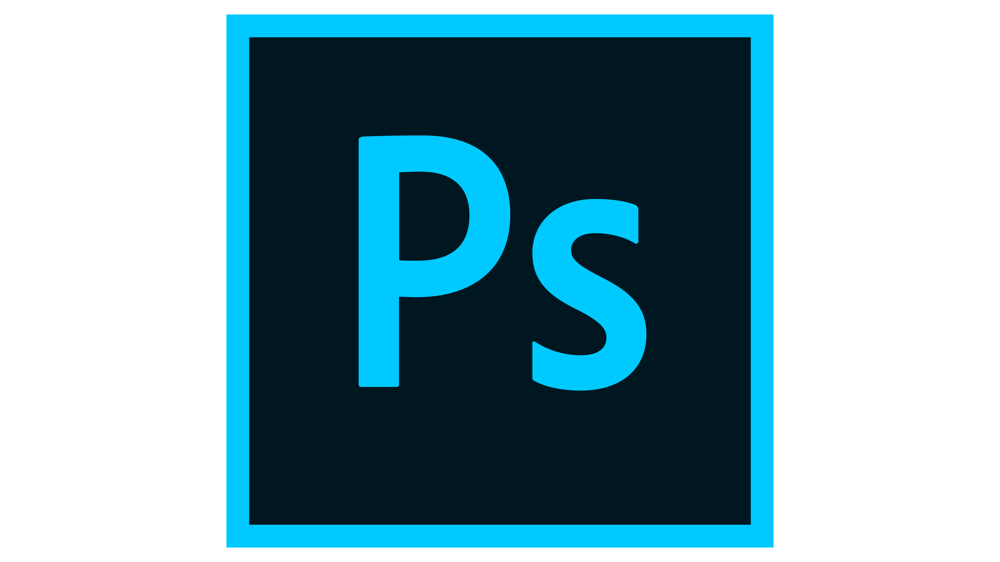

  
  

  
  

🚀🤖🤖🤖🤖🚀
  
  

Coder  apasionado por crear interfaces de usuario que enamoren ✨.  Con bases solidas en HTML, CSS y JavaScript, y actualmente explorando React ⚛️ para llevar mis diseños al siguiente nivel.  Amo convertir los píxeles  en experiencias digitales increíbles. ¡Siempre buscando nuevos desafíos y aprendiendo cosas nuevas!
  
  

   

## My Skill Set  :

### Technologies 💻  

  
  

  
  
  
  
  
  
  

  

   

## Connect with me  

  

  
  

   

## Github Stats  

## My play list

  

  

   

Tu donación me permite seguir aprendiendo y desarrollándome
  

            

 

